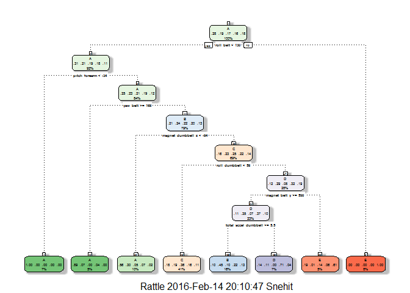

Synopsis
--------

The source of data for this project is taken from:
<http://groupware.les.inf.puc-rio.br/har> by Ugulino, W.; Cardador, D.;
Vega, K.; Velloso, E.; Milidiu, R.; Fuks, H. Wearable Computing:
Accelerometers' Data Classification of Body Postures and Movements.
Proceedings of 21st Brazilian Symposium on Artificial Intelligence.
Advances in Artificial Intelligence - SBIA 2012. In: Lecture Notes in
Computer Science. , pp. 52-61. Curitiba, PR: Springer Berlin /
Heidelberg, 2012. ISBN 978-3-642-34458-9. DOI:
10.1007/978-3-642-34459-6\_6.

In this project we are trying to predict the manner in which a
participant did the exercise from the study where six participants
participated in a dumbell lifting exercise five different ways. The five
ways were exactly according to the specification (Class A), throwing the
elbows to the front (Class B), lifting the dumbbell only halfway (Class
C), lowering the dumbbell only halfway (Class D) and throwing the hips
to the front (Class E). Class A corresponds to the specified execution
of the exercise, while the other 4 classes correspond to common
mistakes.

By processing data gathered from accelerometers on the belt, forearm,
arm, and dumbell of the participants using a machine learning algorithm
we want to predict the appropriate activity quality and finally this
prediction model is used to predict the outcome of the 20 test cases in
the test dataset.

The libraries used in this project are:

    library(caret)
    library(rattle)
    library(rpart.plot)
    library(randomForest)
    library(AppliedPredictiveModeling)

To do:(Remove after doing) You should create a report describing how you
built your model, how you used cross validation, what you think the
expected out of sample error is, and why you made the choices you did.
You will also use your prediction model to predict 20 different test
cases.

Data Processing
---------------

This is the first process of reading all the data from the sources. Here
note that the data is downloaded into the local folder and then read.

    # Treating empty values as NA while reading data.
    df_training <- read.csv("pml-training.csv", na.strings=c("NA",""), header=TRUE)
    colnames_train <- colnames(df_training)
    df_testing <- read.csv("pml-testing.csv", na.strings=c("NA",""), header=TRUE)
    colnames_test <- colnames(df_testing)

    # Checking for similarity of the structures of training and test datasets(excluding classe and problem_id)
    all.equal(colnames_train[1:length(colnames_train)-1], colnames_test[1:length(colnames_train)-1])

    ## [1] TRUE

Processing the data further to take only the relevant data required

    # Count the number of non-NAs in each col.
    nonNAs <- function(x) {
        as.vector(apply(x, 2, function(x) length(which(!is.na(x)))))
    }

    # Build vector of missing data or NA columns to drop.
    colcnts <- nonNAs(df_training)
    drops <- c()
    for (cnt in 1:length(colcnts)) {
        if (colcnts[cnt] < nrow(df_training)) {
            drops <- c(drops, colnames_train[cnt])
        }
    }

    # Drop NA data and the first 7 columns as they're unnecessary for predicting.
    df_training <- df_training[,!(names(df_training) %in% drops)]
    df_training <- df_training[,8:length(colnames(df_training))]

    df_testing <- df_testing[,!(names(df_testing) %in% drops)]
    df_testing <- df_testing[,8:length(colnames(df_testing))]

    # Show remaining columns.
    colnames(df_training)

    ##  [1] "roll_belt"            "pitch_belt"           "yaw_belt"            
    ##  [4] "total_accel_belt"     "gyros_belt_x"         "gyros_belt_y"        
    ##  [7] "gyros_belt_z"         "accel_belt_x"         "accel_belt_y"        
    ## [10] "accel_belt_z"         "magnet_belt_x"        "magnet_belt_y"       
    ## [13] "magnet_belt_z"        "roll_arm"             "pitch_arm"           
    ## [16] "yaw_arm"              "total_accel_arm"      "gyros_arm_x"         
    ## [19] "gyros_arm_y"          "gyros_arm_z"          "accel_arm_x"         
    ## [22] "accel_arm_y"          "accel_arm_z"          "magnet_arm_x"        
    ## [25] "magnet_arm_y"         "magnet_arm_z"         "roll_dumbbell"       
    ## [28] "pitch_dumbbell"       "yaw_dumbbell"         "total_accel_dumbbell"
    ## [31] "gyros_dumbbell_x"     "gyros_dumbbell_y"     "gyros_dumbbell_z"    
    ## [34] "accel_dumbbell_x"     "accel_dumbbell_y"     "accel_dumbbell_z"    
    ## [37] "magnet_dumbbell_x"    "magnet_dumbbell_y"    "magnet_dumbbell_z"   
    ## [40] "roll_forearm"         "pitch_forearm"        "yaw_forearm"         
    ## [43] "total_accel_forearm"  "gyros_forearm_x"      "gyros_forearm_y"     
    ## [46] "gyros_forearm_z"      "accel_forearm_x"      "accel_forearm_y"     
    ## [49] "accel_forearm_z"      "magnet_forearm_x"     "magnet_forearm_y"    
    ## [52] "magnet_forearm_z"     "classe"

    colnames(df_testing)

    ##  [1] "roll_belt"            "pitch_belt"           "yaw_belt"            
    ##  [4] "total_accel_belt"     "gyros_belt_x"         "gyros_belt_y"        
    ##  [7] "gyros_belt_z"         "accel_belt_x"         "accel_belt_y"        
    ## [10] "accel_belt_z"         "magnet_belt_x"        "magnet_belt_y"       
    ## [13] "magnet_belt_z"        "roll_arm"             "pitch_arm"           
    ## [16] "yaw_arm"              "total_accel_arm"      "gyros_arm_x"         
    ## [19] "gyros_arm_y"          "gyros_arm_z"          "accel_arm_x"         
    ## [22] "accel_arm_y"          "accel_arm_z"          "magnet_arm_x"        
    ## [25] "magnet_arm_y"         "magnet_arm_z"         "roll_dumbbell"       
    ## [28] "pitch_dumbbell"       "yaw_dumbbell"         "total_accel_dumbbell"
    ## [31] "gyros_dumbbell_x"     "gyros_dumbbell_y"     "gyros_dumbbell_z"    
    ## [34] "accel_dumbbell_x"     "accel_dumbbell_y"     "accel_dumbbell_z"    
    ## [37] "magnet_dumbbell_x"    "magnet_dumbbell_y"    "magnet_dumbbell_z"   
    ## [40] "roll_forearm"         "pitch_forearm"        "yaw_forearm"         
    ## [43] "total_accel_forearm"  "gyros_forearm_x"      "gyros_forearm_y"     
    ## [46] "gyros_forearm_z"      "accel_forearm_x"      "accel_forearm_y"     
    ## [49] "accel_forearm_z"      "magnet_forearm_x"     "magnet_forearm_y"    
    ## [52] "magnet_forearm_z"     "problem_id"

Since it is a sensor data, we need not create raw data to covariates
though we need to create new covariates from the existing covariates.

Given that all of the near zero variance variables (nsv) are FALSE while
checking from below, there is no need to eliminate any covariates due to
lack of variablility.

    #Checking that covariates have no variablity just in case there is a mismatch
    nsv <- nearZeroVar(df_training, saveMetrics=TRUE)
    nsv

    ##                      freqRatio percentUnique zeroVar   nzv
    ## roll_belt             1.101904     6.7781062   FALSE FALSE
    ## pitch_belt            1.036082     9.3772296   FALSE FALSE
    ## yaw_belt              1.058480     9.9734991   FALSE FALSE
    ## total_accel_belt      1.063160     0.1477933   FALSE FALSE
    ## gyros_belt_x          1.058651     0.7134849   FALSE FALSE
    ## gyros_belt_y          1.144000     0.3516461   FALSE FALSE
    ## gyros_belt_z          1.066214     0.8612782   FALSE FALSE
    ## accel_belt_x          1.055412     0.8357966   FALSE FALSE
    ## accel_belt_y          1.113725     0.7287738   FALSE FALSE
    ## accel_belt_z          1.078767     1.5237998   FALSE FALSE
    ## magnet_belt_x         1.090141     1.6664968   FALSE FALSE
    ## magnet_belt_y         1.099688     1.5187035   FALSE FALSE
    ## magnet_belt_z         1.006369     2.3290184   FALSE FALSE
    ## roll_arm             52.338462    13.5256345   FALSE FALSE
    ## pitch_arm            87.256410    15.7323412   FALSE FALSE
    ## yaw_arm              33.029126    14.6570176   FALSE FALSE
    ## total_accel_arm       1.024526     0.3363572   FALSE FALSE
    ## gyros_arm_x           1.015504     3.2769341   FALSE FALSE
    ## gyros_arm_y           1.454369     1.9162165   FALSE FALSE
    ## gyros_arm_z           1.110687     1.2638875   FALSE FALSE
    ## accel_arm_x           1.017341     3.9598410   FALSE FALSE
    ## accel_arm_y           1.140187     2.7367241   FALSE FALSE
    ## accel_arm_z           1.128000     4.0362858   FALSE FALSE
    ## magnet_arm_x          1.000000     6.8239731   FALSE FALSE
    ## magnet_arm_y          1.056818     4.4439914   FALSE FALSE
    ## magnet_arm_z          1.036364     6.4468454   FALSE FALSE
    ## roll_dumbbell         1.022388    84.2065029   FALSE FALSE
    ## pitch_dumbbell        2.277372    81.7449801   FALSE FALSE
    ## yaw_dumbbell          1.132231    83.4828254   FALSE FALSE
    ## total_accel_dumbbell  1.072634     0.2191418   FALSE FALSE
    ## gyros_dumbbell_x      1.003268     1.2282132   FALSE FALSE
    ## gyros_dumbbell_y      1.264957     1.4167771   FALSE FALSE
    ## gyros_dumbbell_z      1.060100     1.0498420   FALSE FALSE
    ## accel_dumbbell_x      1.018018     2.1659362   FALSE FALSE
    ## accel_dumbbell_y      1.053061     2.3748853   FALSE FALSE
    ## accel_dumbbell_z      1.133333     2.0894914   FALSE FALSE
    ## magnet_dumbbell_x     1.098266     5.7486495   FALSE FALSE
    ## magnet_dumbbell_y     1.197740     4.3012945   FALSE FALSE
    ## magnet_dumbbell_z     1.020833     3.4451126   FALSE FALSE
    ## roll_forearm         11.589286    11.0895933   FALSE FALSE
    ## pitch_forearm        65.983051    14.8557741   FALSE FALSE
    ## yaw_forearm          15.322835    10.1467740   FALSE FALSE
    ## total_accel_forearm   1.128928     0.3567424   FALSE FALSE
    ## gyros_forearm_x       1.059273     1.5187035   FALSE FALSE
    ## gyros_forearm_y       1.036554     3.7763735   FALSE FALSE
    ## gyros_forearm_z       1.122917     1.5645704   FALSE FALSE
    ## accel_forearm_x       1.126437     4.0464784   FALSE FALSE
    ## accel_forearm_y       1.059406     5.1116094   FALSE FALSE
    ## accel_forearm_z       1.006250     2.9558659   FALSE FALSE
    ## magnet_forearm_x      1.012346     7.7667924   FALSE FALSE
    ## magnet_forearm_y      1.246914     9.5403119   FALSE FALSE
    ## magnet_forearm_z      1.000000     8.5771073   FALSE FALSE
    ## classe                1.469581     0.0254816   FALSE FALSE

Division of training set
------------------------

The training data set is pretty large and the testing set is very small.
So we are breaking the training set into four equal parts and then each
part is split into training and testing sets in 60:40 ratio.

    # Divide the given training set into 4 roughly equal sets.
    set.seed(666)
    ids_small <- createDataPartition(y=df_training$classe, p=0.25, list=FALSE)
    df_small1 <- df_training[ids_small,]
    df_remainder <- df_training[-ids_small,]
    set.seed(666)
    ids_small <- createDataPartition(y=df_remainder$classe, p=0.33, list=FALSE)
    df_small2 <- df_remainder[ids_small,]
    df_remainder <- df_remainder[-ids_small,]
    set.seed(666)
    ids_small <- createDataPartition(y=df_remainder$classe, p=0.5, list=FALSE)
    df_small3 <- df_remainder[ids_small,]
    df_small4 <- df_remainder[-ids_small,]
    # Divide each of these 4 sets into training (60%) and test (40%) sets.
    set.seed(666)
    inTrain <- createDataPartition(y=df_small1$classe, p=0.6, list=FALSE)
    df_small_training1 <- df_small1[inTrain,]
    df_small_testing1 <- df_small1[-inTrain,]
    set.seed(666)
    inTrain <- createDataPartition(y=df_small2$classe, p=0.6, list=FALSE)
    df_small_training2 <- df_small2[inTrain,]
    df_small_testing2 <- df_small2[-inTrain,]
    set.seed(666)
    inTrain <- createDataPartition(y=df_small3$classe, p=0.6, list=FALSE)
    df_small_training3 <- df_small3[inTrain,]
    df_small_testing3 <- df_small3[-inTrain,]
    set.seed(666)
    inTrain <- createDataPartition(y=df_small4$classe, p=0.6, list=FALSE)
    df_small_training4 <- df_small4[inTrain,]
    df_small_testing4 <- df_small4[-inTrain,]

Evaluation
----------

I chose two different algorithms via the caret package: classification
trees (method = rpart) and random forests (method = rf).

### Classification trees

Firstly, I am trying classification trees and then introduce
preprocessing and cross validation.

    # Train on training set 1 of 4 with no extra features.
    set.seed(666)
    modFit <- train(df_small_training1$classe ~ ., data = df_small_training1, method="rpart")
    print(modFit, digits=3)

    ## CART 
    ## 
    ## 2946 samples
    ##   52 predictor
    ##    5 classes: 'A', 'B', 'C', 'D', 'E' 
    ## 
    ## No pre-processing
    ## Resampling: Bootstrapped (25 reps) 
    ## Summary of sample sizes: 2946, 2946, 2946, 2946, 2946, 2946, ... 
    ## Resampling results across tuning parameters:
    ## 
    ##   cp      Accuracy  Kappa   Accuracy SD  Kappa SD
    ##   0.0346  0.531     0.4003  0.0355       0.0479  
    ##   0.0442  0.471     0.3076  0.0555       0.0967  
    ##   0.1162  0.324     0.0602  0.0456       0.0641  
    ## 
    ## Accuracy was used to select the optimal model using  the largest value.
    ## The final value used for the model was cp = 0.0346.

    print(modFit$finalModel, digits=3)

    ## n= 2946 
    ## 
    ## node), split, n, loss, yval, (yprob)
    ##       * denotes terminal node
    ## 
    ##   1) root 2946 2110 A (0.28 0.19 0.17 0.16 0.18)  
    ##     2) roll_belt< 130 2699 1860 A (0.31 0.21 0.19 0.18 0.11)  
    ##       4) pitch_forearm< -34 220    0 A (1 0 0 0 0) *
    ##       5) pitch_forearm>=-34 2479 1860 A (0.25 0.23 0.21 0.19 0.12)  
    ##        10) yaw_belt>=168 138   15 A (0.89 0.072 0 0.036 0) *
    ##        11) yaw_belt< 168 2341 1780 B (0.21 0.24 0.22 0.2 0.13)  
    ##          22) magnet_dumbbell_z< -83.5 305  134 A (0.56 0.3 0.046 0.069 0.02) *
    ##          23) magnet_dumbbell_z>=-83.5 2036 1540 C (0.16 0.23 0.25 0.22 0.14)  
    ##            46) roll_dumbbell< 57.7 1209  776 C (0.18 0.19 0.36 0.16 0.11) *
    ##            47) roll_dumbbell>=57.7 827  565 D (0.12 0.29 0.081 0.32 0.19)  
    ##              94) magnet_belt_y>=590 687  433 D (0.11 0.35 0.07 0.37 0.1)  
    ##               188) total_accel_dumbbell>=5.5 474  260 B (0.097 0.45 0.1 0.22 0.13) *
    ##               189) total_accel_dumbbell< 5.5 213   62 D (0.14 0.11 0 0.71 0.042) *
    ##              95) magnet_belt_y< 590 140   55 E (0.19 0.014 0.14 0.057 0.61) *
    ##     3) roll_belt>=130 247    1 E (0.004 0 0 0 1) *

    fancyRpartPlot(modFit$finalModel)

<!-- -->

    # Run against testing set 1 of 4 with no extra features.
    predictions <- predict(modFit, newdata=df_small_testing1)
    print(confusionMatrix(predictions, df_small_testing1$classe), digits=4)

    ## Confusion Matrix and Statistics
    ## 
    ##           Reference
    ## Prediction   A   B   C   D   E
    ##          A 368  74  11  28   8
    ##          B  24 151  25  83  30
    ##          C 135 148 288 138  99
    ##          D  15   7   0  69   4
    ##          E  16   0  18   3 219
    ## 
    ## Overall Statistics
    ##                                           
    ##                Accuracy : 0.5584          
    ##                  95% CI : (0.5361, 0.5805)
    ##     No Information Rate : 0.2845          
    ##     P-Value [Acc > NIR] : < 2.2e-16       
    ##                                           
    ##                   Kappa : 0.4441          
    ##  Mcnemar's Test P-Value : < 2.2e-16       
    ## 
    ## Statistics by Class:
    ## 
    ##                      Class: A Class: B Class: C Class: D Class: E
    ## Sensitivity            0.6595   0.3974   0.8421  0.21495   0.6083
    ## Specificity            0.9138   0.8975   0.6788  0.98415   0.9769
    ## Pos Pred Value         0.7526   0.4824   0.3564  0.72632   0.8555
    ## Neg Pred Value         0.8709   0.8610   0.9532  0.86495   0.9173
    ## Prevalence             0.2845   0.1938   0.1744  0.16369   0.1836
    ## Detection Rate         0.1877   0.0770   0.1469  0.03519   0.1117
    ## Detection Prevalence   0.2494   0.1596   0.4120  0.04844   0.1305
    ## Balanced Accuracy      0.7866   0.6475   0.7605  0.59955   0.7926

Here you can observe that the accuracy is too low if you try to predict
without using any extra features.

So upon using the preprocessing and cross validation, you can expect for
a better results. So here it goes:

    # Train on training set 1 of 4 with only preprocessing.
    set.seed(666)
    modFit <- train(df_small_training1$classe ~ .,  preProcess=c("center", "scale"), data = df_small_training1, method="rpart")
    print(modFit, digits=3)

    ## CART 
    ## 
    ## 2946 samples
    ##   52 predictor
    ##    5 classes: 'A', 'B', 'C', 'D', 'E' 
    ## 
    ## Pre-processing: centered (52), scaled (52) 
    ## Resampling: Bootstrapped (25 reps) 
    ## Summary of sample sizes: 2946, 2946, 2946, 2946, 2946, 2946, ... 
    ## Resampling results across tuning parameters:
    ## 
    ##   cp      Accuracy  Kappa   Accuracy SD  Kappa SD
    ##   0.0346  0.531     0.4003  0.0355       0.0479  
    ##   0.0442  0.471     0.3077  0.0555       0.0968  
    ##   0.1162  0.324     0.0602  0.0456       0.0641  
    ## 
    ## Accuracy was used to select the optimal model using  the largest value.
    ## The final value used for the model was cp = 0.0346.

    # Train on training set 1 of 4 with only cross validation.
    set.seed(666)
    modFit <- train(df_small_training1$classe ~ .,  trControl=trainControl(method = "cv", number = 4), data = df_small_training1, method="rpart")
    print(modFit, digits=3)

    ## CART 
    ## 
    ## 2946 samples
    ##   52 predictor
    ##    5 classes: 'A', 'B', 'C', 'D', 'E' 
    ## 
    ## No pre-processing
    ## Resampling: Cross-Validated (4 fold) 
    ## Summary of sample sizes: 2212, 2209, 2208, 2209 
    ## Resampling results across tuning parameters:
    ## 
    ##   cp      Accuracy  Kappa   Accuracy SD  Kappa SD
    ##   0.0346  0.552     0.4266  0.0383       0.0542  
    ##   0.0442  0.470     0.3041  0.0689       0.1197  
    ##   0.1162  0.344     0.0914  0.0405       0.0610  
    ## 
    ## Accuracy was used to select the optimal model using  the largest value.
    ## The final value used for the model was cp = 0.0346.

    # Train on training set 1 of 4 with both preprocessing and cross validation.
    set.seed(666)
    modFit <- train(df_small_training1$classe ~ .,  preProcess=c("center", "scale"), trControl=trainControl(method = "cv", number = 4), data = df_small_training1, method="rpart")
    print(modFit, digits=3)

    ## CART 
    ## 
    ## 2946 samples
    ##   52 predictor
    ##    5 classes: 'A', 'B', 'C', 'D', 'E' 
    ## 
    ## Pre-processing: centered (52), scaled (52) 
    ## Resampling: Cross-Validated (4 fold) 
    ## Summary of sample sizes: 2212, 2209, 2208, 2209 
    ## Resampling results across tuning parameters:
    ## 
    ##   cp      Accuracy  Kappa   Accuracy SD  Kappa SD
    ##   0.0346  0.552     0.4266  0.0383       0.0542  
    ##   0.0442  0.470     0.3041  0.0689       0.1197  
    ##   0.1162  0.344     0.0914  0.0405       0.0610  
    ## 
    ## Accuracy was used to select the optimal model using  the largest value.
    ## The final value used for the model was cp = 0.0346.

    # Run against testing set 1 of 4 with both preprocessing and cross validation.
    predictions <- predict(modFit, newdata=df_small_testing1)
    print(confusionMatrix(predictions, df_small_testing1$classe), digits=4)

    ## Confusion Matrix and Statistics
    ## 
    ##           Reference
    ## Prediction   A   B   C   D   E
    ##          A 368  74  11  28   8
    ##          B  24 151  25  83  30
    ##          C 135 148 288 138  99
    ##          D  15   7   0  69   4
    ##          E  16   0  18   3 219
    ## 
    ## Overall Statistics
    ##                                           
    ##                Accuracy : 0.5584          
    ##                  95% CI : (0.5361, 0.5805)
    ##     No Information Rate : 0.2845          
    ##     P-Value [Acc > NIR] : < 2.2e-16       
    ##                                           
    ##                   Kappa : 0.4441          
    ##  Mcnemar's Test P-Value : < 2.2e-16       
    ## 
    ## Statistics by Class:
    ## 
    ##                      Class: A Class: B Class: C Class: D Class: E
    ## Sensitivity            0.6595   0.3974   0.8421  0.21495   0.6083
    ## Specificity            0.9138   0.8975   0.6788  0.98415   0.9769
    ## Pos Pred Value         0.7526   0.4824   0.3564  0.72632   0.8555
    ## Neg Pred Value         0.8709   0.8610   0.9532  0.86495   0.9173
    ## Prevalence             0.2845   0.1938   0.1744  0.16369   0.1836
    ## Detection Rate         0.1877   0.0770   0.1469  0.03519   0.1117
    ## Detection Prevalence   0.2494   0.1596   0.4120  0.04844   0.1305
    ## Balanced Accuracy      0.7866   0.6475   0.7605  0.59955   0.7926

When we tried with preprocessing and cross validation there was just
some minimal improvement (accuracy rate rose from 0.531 to 0.552 against
training sets). But when run against the corresponding testing set, the
accuracy rate was identical (0.5584). So this is not helping much.

### Random Forests

    # Train on training set 1 of 4 with only cross validation.
    set.seed(666)
    modFit <- train(df_small_training1$classe ~ ., method="rf", trControl=trainControl(method = "cv", number = 4), data=df_small_training1)
    print(modFit, digits=3)

    ## Random Forest 
    ## 
    ## 2946 samples
    ##   52 predictor
    ##    5 classes: 'A', 'B', 'C', 'D', 'E' 
    ## 
    ## No pre-processing
    ## Resampling: Cross-Validated (4 fold) 
    ## Summary of sample sizes: 2212, 2209, 2208, 2209 
    ## Resampling results across tuning parameters:
    ## 
    ##   mtry  Accuracy  Kappa  Accuracy SD  Kappa SD
    ##    2    0.949     0.935  0.00351      0.00451 
    ##   27    0.955     0.943  0.00620      0.00784 
    ##   52    0.951     0.938  0.01096      0.01386 
    ## 
    ## Accuracy was used to select the optimal model using  the largest value.
    ## The final value used for the model was mtry = 27.

    # Run against testing set 1 of 4.
    predictions <- predict(modFit, newdata=df_small_testing1)
    print(confusionMatrix(predictions, df_small_testing1$classe), digits=4)

    ## Confusion Matrix and Statistics
    ## 
    ##           Reference
    ## Prediction   A   B   C   D   E
    ##          A 555  12   1   0   1
    ##          B   2 359  11   0   0
    ##          C   0   8 325   4   5
    ##          D   0   1   5 313   1
    ##          E   1   0   0   4 353
    ## 
    ## Overall Statistics
    ##                                           
    ##                Accuracy : 0.9714          
    ##                  95% CI : (0.9631, 0.9784)
    ##     No Information Rate : 0.2845          
    ##     P-Value [Acc > NIR] : < 2.2e-16       
    ##                                           
    ##                   Kappa : 0.9639          
    ##  Mcnemar's Test P-Value : NA              
    ## 
    ## Statistics by Class:
    ## 
    ##                      Class: A Class: B Class: C Class: D Class: E
    ## Sensitivity            0.9946   0.9447   0.9503   0.9751   0.9806
    ## Specificity            0.9900   0.9918   0.9895   0.9957   0.9969
    ## Pos Pred Value         0.9754   0.9651   0.9503   0.9781   0.9860
    ## Neg Pred Value         0.9978   0.9868   0.9895   0.9951   0.9956
    ## Prevalence             0.2845   0.1938   0.1744   0.1637   0.1836
    ## Detection Rate         0.2830   0.1831   0.1657   0.1596   0.1800
    ## Detection Prevalence   0.2902   0.1897   0.1744   0.1632   0.1826
    ## Balanced Accuracy      0.9923   0.9683   0.9699   0.9854   0.9887

    # Run against 20 testing set given separately.
    print(predict(modFit, newdata=df_testing))

    ##  [1] B A A A A E D B A A B C B A E E A B B B
    ## Levels: A B C D E

    # Train on training set 1 of 4 with both preprocessing and cross validation.
    set.seed(666)
    modFit <- train(df_small_training1$classe ~ ., method="rf", preProcess=c("center", "scale"), trControl=trainControl(method = "cv", number = 4), data=df_small_training1)
    print(modFit, digits=3)

    ## Random Forest 
    ## 
    ## 2946 samples
    ##   52 predictor
    ##    5 classes: 'A', 'B', 'C', 'D', 'E' 
    ## 
    ## Pre-processing: centered (52), scaled (52) 
    ## Resampling: Cross-Validated (4 fold) 
    ## Summary of sample sizes: 2212, 2209, 2208, 2209 
    ## Resampling results across tuning parameters:
    ## 
    ##   mtry  Accuracy  Kappa  Accuracy SD  Kappa SD
    ##    2    0.951     0.939  0.00588      0.00745 
    ##   27    0.958     0.946  0.00515      0.00652 
    ##   52    0.952     0.939  0.00932      0.01179 
    ## 
    ## Accuracy was used to select the optimal model using  the largest value.
    ## The final value used for the model was mtry = 27.

    # Run against testing set 1 of 4.
    predictions <- predict(modFit, newdata=df_small_testing1)
    print(confusionMatrix(predictions, df_small_testing1$classe), digits=4)

    ## Confusion Matrix and Statistics
    ## 
    ##           Reference
    ## Prediction   A   B   C   D   E
    ##          A 556  11   0   0   0
    ##          B   2 357  12   0   0
    ##          C   0  11 325   5   5
    ##          D   0   1   5 312   2
    ##          E   0   0   0   4 353
    ## 
    ## Overall Statistics
    ##                                           
    ##                Accuracy : 0.9704          
    ##                  95% CI : (0.9619, 0.9775)
    ##     No Information Rate : 0.2845          
    ##     P-Value [Acc > NIR] : < 2.2e-16       
    ##                                           
    ##                   Kappa : 0.9626          
    ##  Mcnemar's Test P-Value : NA              
    ## 
    ## Statistics by Class:
    ## 
    ##                      Class: A Class: B Class: C Class: D Class: E
    ## Sensitivity            0.9964   0.9395   0.9503   0.9720   0.9806
    ## Specificity            0.9922   0.9911   0.9870   0.9951   0.9975
    ## Pos Pred Value         0.9806   0.9623   0.9393   0.9750   0.9888
    ## Neg Pred Value         0.9986   0.9855   0.9895   0.9945   0.9956
    ## Prevalence             0.2845   0.1938   0.1744   0.1637   0.1836
    ## Detection Rate         0.2835   0.1820   0.1657   0.1591   0.1800
    ## Detection Prevalence   0.2891   0.1892   0.1764   0.1632   0.1820
    ## Balanced Accuracy      0.9943   0.9653   0.9687   0.9835   0.9890

    # Run against 20 testing set given separately.
    print(predict(modFit, newdata=df_testing))

    ##  [1] B A A A A E D B A A B C B A E E A B B B
    ## Levels: A B C D E

    # Train on training set 2 of 4 with only cross validation.
    set.seed(666)
    modFit <- train(df_small_training2$classe ~ ., method="rf", preProcess=c("center", "scale"), trControl=trainControl(method = "cv", number = 4), data=df_small_training2)
    print(modFit, digits=3)

    ## Random Forest 
    ## 
    ## 2917 samples
    ##   52 predictor
    ##    5 classes: 'A', 'B', 'C', 'D', 'E' 
    ## 
    ## Pre-processing: centered (52), scaled (52) 
    ## Resampling: Cross-Validated (4 fold) 
    ## Summary of sample sizes: 2188, 2188, 2187, 2188 
    ## Resampling results across tuning parameters:
    ## 
    ##   mtry  Accuracy  Kappa  Accuracy SD  Kappa SD
    ##    2    0.951     0.938  0.01065      0.01353 
    ##   27    0.953     0.941  0.01068      0.01357 
    ##   52    0.945     0.930  0.00725      0.00919 
    ## 
    ## Accuracy was used to select the optimal model using  the largest value.
    ## The final value used for the model was mtry = 27.

    # Run against testing set 2 of 4.
    predictions <- predict(modFit, newdata=df_small_testing2)
    print(confusionMatrix(predictions, df_small_testing2$classe), digits=4)

    ## Confusion Matrix and Statistics
    ## 
    ##           Reference
    ## Prediction   A   B   C   D   E
    ##          A 547  11   0   1   0
    ##          B   3 352  11   1   5
    ##          C   0  13 326  11   5
    ##          D   1   0   1 303   5
    ##          E   1   0   0   2 342
    ## 
    ## Overall Statistics
    ##                                           
    ##                Accuracy : 0.9634          
    ##                  95% CI : (0.9541, 0.9713)
    ##     No Information Rate : 0.2844          
    ##     P-Value [Acc > NIR] : < 2.2e-16       
    ##                                           
    ##                   Kappa : 0.9537          
    ##  Mcnemar's Test P-Value : NA              
    ## 
    ## Statistics by Class:
    ## 
    ##                      Class: A Class: B Class: C Class: D Class: E
    ## Sensitivity            0.9909   0.9362   0.9645   0.9528   0.9580
    ## Specificity            0.9914   0.9872   0.9819   0.9957   0.9981
    ## Pos Pred Value         0.9785   0.9462   0.9183   0.9774   0.9913
    ## Neg Pred Value         0.9964   0.9847   0.9924   0.9908   0.9906
    ## Prevalence             0.2844   0.1937   0.1741   0.1638   0.1839
    ## Detection Rate         0.2818   0.1813   0.1680   0.1561   0.1762
    ## Detection Prevalence   0.2880   0.1917   0.1829   0.1597   0.1777
    ## Balanced Accuracy      0.9912   0.9617   0.9732   0.9743   0.9780

    # Run against 20 testing set given separately.
    print(predict(modFit, newdata=df_testing))

    ##  [1] B A B A A E D B A A B C B A E E A B B B
    ## Levels: A B C D E

    # Train on training set 3 of 4 with only cross validation.
    set.seed(666)
    modFit <- train(df_small_training3$classe ~ ., method="rf", preProcess=c("center", "scale"), trControl=trainControl(method = "cv", number = 4), data=df_small_training3)
    print(modFit, digits=3)

    ## Random Forest 
    ## 
    ## 2960 samples
    ##   52 predictor
    ##    5 classes: 'A', 'B', 'C', 'D', 'E' 
    ## 
    ## Pre-processing: centered (52), scaled (52) 
    ## Resampling: Cross-Validated (4 fold) 
    ## Summary of sample sizes: 2219, 2221, 2220, 2220 
    ## Resampling results across tuning parameters:
    ## 
    ##   mtry  Accuracy  Kappa  Accuracy SD  Kappa SD
    ##    2    0.949     0.935  0.01021      0.0129  
    ##   27    0.950     0.937  0.00859      0.0109  
    ##   52    0.942     0.926  0.01060      0.0134  
    ## 
    ## Accuracy was used to select the optimal model using  the largest value.
    ## The final value used for the model was mtry = 27.

    # Run against testing set 3 of 4.
    predictions <- predict(modFit, newdata=df_small_testing3)
    print(confusionMatrix(predictions, df_small_testing3$classe), digits=4)

    ## Confusion Matrix and Statistics
    ## 
    ##           Reference
    ## Prediction   A   B   C   D   E
    ##          A 556  11   0   1   0
    ##          B   2 357  20   0   4
    ##          C   1  12 319   7   3
    ##          D   1   1   3 313   1
    ##          E   0   0   2   2 354
    ## 
    ## Overall Statistics
    ##                                           
    ##                Accuracy : 0.964           
    ##                  95% CI : (0.9548, 0.9717)
    ##     No Information Rate : 0.2843          
    ##     P-Value [Acc > NIR] : < 2.2e-16       
    ##                                           
    ##                   Kappa : 0.9544          
    ##  Mcnemar's Test P-Value : NA              
    ## 
    ## Statistics by Class:
    ## 
    ##                      Class: A Class: B Class: C Class: D Class: E
    ## Sensitivity            0.9929   0.9370   0.9273   0.9690   0.9779
    ## Specificity            0.9915   0.9836   0.9859   0.9964   0.9975
    ## Pos Pred Value         0.9789   0.9321   0.9327   0.9812   0.9888
    ## Neg Pred Value         0.9971   0.9849   0.9846   0.9939   0.9950
    ## Prevalence             0.2843   0.1934   0.1746   0.1640   0.1838
    ## Detection Rate         0.2822   0.1812   0.1619   0.1589   0.1797
    ## Detection Prevalence   0.2883   0.1944   0.1736   0.1619   0.1817
    ## Balanced Accuracy      0.9922   0.9603   0.9566   0.9827   0.9877

    # Run against 20 testing set provided by Professor Leek.
    print(predict(modFit, newdata=df_testing))

    ##  [1] B A B A A E D B A A B C B A E E A B B B
    ## Levels: A B C D E

    # Train on training set 4 of 4 with only cross validation.
    set.seed(666)
    modFit <- train(df_small_training4$classe ~ ., method="rf", preProcess=c("center", "scale"), trControl=trainControl(method = "cv", number = 4), data=df_small_training4)
    print(modFit, digits=3)

    ## Random Forest 
    ## 
    ## 2958 samples
    ##   52 predictor
    ##    5 classes: 'A', 'B', 'C', 'D', 'E' 
    ## 
    ## Pre-processing: centered (52), scaled (52) 
    ## Resampling: Cross-Validated (4 fold) 
    ## Summary of sample sizes: 2218, 2219, 2219, 2218 
    ## Resampling results across tuning parameters:
    ## 
    ##   mtry  Accuracy  Kappa  Accuracy SD  Kappa SD
    ##    2    0.950     0.936  0.01168      0.01483 
    ##   27    0.954     0.942  0.00863      0.01093 
    ##   52    0.950     0.937  0.00721      0.00911 
    ## 
    ## Accuracy was used to select the optimal model using  the largest value.
    ## The final value used for the model was mtry = 27.

    # Run against testing set 4 of 4.
    predictions <- predict(modFit, newdata=df_small_testing4)
    print(confusionMatrix(predictions, df_small_testing4$classe), digits=4)

    ## Confusion Matrix and Statistics
    ## 
    ##           Reference
    ## Prediction   A   B   C   D   E
    ##          A 552  18   0   0   0
    ##          B   5 358  19   3   3
    ##          C   2   5 319   7   6
    ##          D   1   0   5 312   6
    ##          E   0   0   0   1 347
    ## 
    ## Overall Statistics
    ##                                           
    ##                Accuracy : 0.9589          
    ##                  95% CI : (0.9491, 0.9672)
    ##     No Information Rate : 0.2844          
    ##     P-Value [Acc > NIR] : < 2.2e-16       
    ##                                           
    ##                   Kappa : 0.9479          
    ##  Mcnemar's Test P-Value : NA              
    ## 
    ## Statistics by Class:
    ## 
    ##                      Class: A Class: B Class: C Class: D Class: E
    ## Sensitivity            0.9857   0.9396   0.9300   0.9659   0.9586
    ## Specificity            0.9872   0.9811   0.9877   0.9927   0.9994
    ## Pos Pred Value         0.9684   0.9227   0.9410   0.9630   0.9971
    ## Neg Pred Value         0.9943   0.9855   0.9853   0.9933   0.9907
    ## Prevalence             0.2844   0.1935   0.1742   0.1640   0.1838
    ## Detection Rate         0.2803   0.1818   0.1620   0.1585   0.1762
    ## Detection Prevalence   0.2895   0.1971   0.1722   0.1646   0.1767
    ## Balanced Accuracy      0.9865   0.9604   0.9589   0.9793   0.9790

    # Run against 20 testing set given separately.
    print(predict(modFit, newdata=df_testing))

    ##  [1] B A B A A E D D A A B C B A E E A B B B
    ## Levels: A B C D E

### Out of sample error

The error rate after running the predict() function on the 4 testing
sets is obtained respectively as:   *RF(Random Forest) with both
preprocessing and cross validation for Testing Set 1: 1 - .9714 = 0.0286
  *RF(Random Forest) with both preprocessing and cross validation
for Testing Set 2: 1 - .9634 = 0.0366   *RF(Random Forest) with both
preprocessing and cross validation for Testing Set 3: 1 - .9655 = 0.0345
  *RF(Random Forest) with both preprocessing and cross validation
for Testing Set 4: 1 - .9563 = 0.0437  

Now taking out the average of error obtained by applying RF on the test
sets, we can say the out of sample error is 0.03585.

Results for the Quiz part
-------------------------

I had obtained three separate predictions by applying the 4 models
against the actual 20 item training set:   1. Accuracy Rate .9714
Predictions: B A A A A E D B A A B C B A E E A B B B   2. Accuracy
Rates .9634 and .9655 Predictions: B A B A A E D B A A B C B A E E A B B
B   3. Accuracy Rate .9563 Predictions: B A B A A E D D A A B C B A
E E A B B B  

I initially tried with the first one and got one wrong but the second
gave all right predictions.
